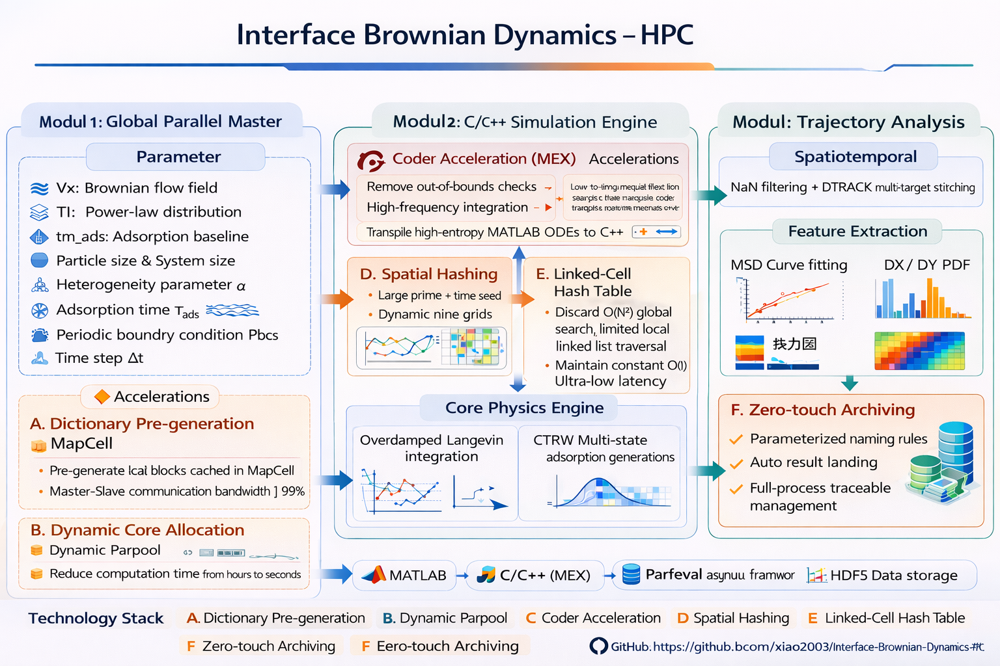

# Interface Brownian Dynamics HPC

### MATLAB 框架用于界面单分子跳跃 - 停留 - 扩散过程的并行仿真与统计分析


-blue)


Interface Brownian Dynamics HPC 是一个围绕界面非高斯输运问题构建的 MATLAB 仿真项目。代码通过“缺陷吸附位点 + 停留时间分布 + 扩散 - 漂移耦合 + 轨迹统计分析”的建模方式，研究单分子在异质界面上的输运行为。当前仓库已经形成清晰的主程序、仿真引擎、分布采样和分析模块结构，适合作为论文研究、参数扫描和答辩展示的基础代码。

## 最近整理

- 清扫了仓库根目录的历史副本脚本，只保留分层目录中的正式版本
- 将静态哈希查表版主程序与 MEX 入口合并回 `01_Main/` 和 `02_Simulation_Engine/`
- 保持 `README` 与当前目录结构、执行流程和二进制接口一致

---

## 架构展示图



---

## 1. 项目目标

本项目关注的核心问题是：界面上的局部吸附、长尾停留和空间异质性，如何改变单分子的宏观输运统计行为。相比经典均匀布朗扩散模型，这类体系更容易出现：

- 非高斯位移分布
- 长尾停留事件
- 跳跃长度统计异常
- 漂移与扩散耦合导致的分布偏斜
- MSD 演化偏离简单线性关系

因此，项目的目标不是单纯生成随机轨迹，而是构建一套可批量扫描参数、可输出关键统计量、可支持物理解释的仿真流程。

---

## 2. 当前代码结构

```text
.
├── 01_Main/
│   └── JumpingAtMolecularFreq.m
├── 02_Simulation_Engine/
│   ├── Sub_JumpingBetweenEachFrame.m
│   ├── Sub_JumpingBetweenEachFrame_mex.m
│   └── Sub_JumpingBetweenEachFrame_mex_mex.mexw64
├── 03_Distributions/
│   ├── Sub_GenerateExponentialWithMean.m
│   ├── Sub_GeneratePowerLawWithMean.m
│   └── Sub_GenerateUniformWithMean.m
├── 04_Analysis_Modules/
│   ├── CDF.m
│   ├── Smart_Folder_Plot.m
│   ├── Sub_JumpingAnalysis.m
│   ├── Sub_MergingLocalizationsInSameFrame.m
│   ├── Sub_ShowProbabilityDXDY.m
│   ├── Sub_TrajectoryAnalysis.m
│   └── track.m
├── 05_Utils_and_Tests/
│   ├── Do_Compile_HPC.m
│   └── killall.m
├── Archive_Deprecated/
│   └── .gitkeep
├── .gitignore
└── README.md
```

### 模块职责

- `01_Main/JumpingAtMolecularFreq.m`
  主入口。负责参数配置、缺陷地图预生成、任务表展开、并行调度、结果回收、自动归档与日志输出。

- `02_Simulation_Engine/`
  单帧内微观跳跃推进引擎。`Sub_JumpingBetweenEachFrame_mex.m` 是 MATLAB Coder 目标文件，`Sub_JumpingBetweenEachFrame_mex_mex.mexw64` 是当前可直接调用的 Windows MEX 二进制。

- `03_Distributions/`
  停留时间分布采样模块。分别提供幂律、指数、均匀分布的随机数生成。

- `04_Analysis_Modules/`
  轨迹整理与统计分析模块，包含同帧点合并、轨迹拼接、位移统计、跳跃统计、批量文件夹分析和分布可视化工具。

- `05_Utils_and_Tests/`
  工具与辅助脚本。当前包括并行环境清理脚本 `killall.m` 和 MEX 编译辅助脚本 `Do_Compile_HPC.m`。

---

## 3. 主程序工作流

当前版本的主程序 `JumpingAtMolecularFreq.m` 可以概括为以下 6 个阶段。

### 3.1 初始化并行环境

程序启动时先关闭旧并行池，再根据任务总数动态建立本地并行池：

```matlab
NumCores = min(TotalTasks, max(1, feature('numcores') - 2));
pool = parpool('local', NumCores);
```

这样做的目的是让核心数跟随任务规模变化，并给桌面环境保留余量。

### 3.2 配置物理参数与扫描参数

主程序直接定义扩散、吸附和漂移相关参数，例如：

- `t_total`：总采样时间尺度
- `jf`：分子跳跃频率
- `D`：理论扩散系数
- `adR`：吸附半径
- `ds`：缺陷平均间距
- `Ts_list`：采样时间列表
- `tmads_list`：平均吸附时间列表
- `TimeIndex_list`：幂律指数列表
- `Xshiftvelocity_list / Yshiftvelocity_list`：漂移速度列表
- `DistributionModes`：分布类型列表

其中单步随机热涨落的特征尺度由

```matlab
k = sqrt(2*D*tau) * 1e9;
```

给出，`tau = 1/jf`。这把连续扩散系数映射到了离散跳跃模型中的单步位移尺度。

### 3.3 预生成缺陷地图与二进制静态哈希表

主程序不会显式生成整张超大空间地图，而是先构造一个边长为 `L_block = 10000 nm` 的基础缺陷区块，再通过旋转生成 4 张局部地图：

- 原始图 `Map1`
- 旋转 90 度 `Map2`
- 旋转 180 度 `Map3`
- 旋转 270 度 `Map4`

随后程序会把每张地图离散到固定 `100 x 100` 的局部哈希网格里，预先写入：

- `HashX`
- `HashY`
- `HashCount`

当前版本不会再把整套哈希表直接广播到每个 worker，而是先把它们写入 `SharedHash_*.bin` 二进制文件，再由 worker 使用 `memmapfile` 只读映射。这种实现的目标是降低大规模并行时的重复内存占用。这样可以同时实现：

- 大尺度界面异质性的轻量表示
- worker 之间共享同一份磁盘映射数据源
- 重复实验之间可控的随机对照
- 为底层 MEX 提供缓存友好的连续内存布局

### 3.4 展开任务表

主程序把所有参数组合展开成 `Tasks` 矩阵，每一行对应一组独立仿真条件，包含：

- `Ts`
- `tm_ads`
- `TI`
- `vx`
- `vy`
- `DistMode`
- `Rep`
- `x0`
- `y0`

这一步把科学问题离散成可批量运行的任务集合。

### 3.5 异步并行执行

任务通过 `parfeval` 异步提交，由 `fetchNext` 按完成顺序回收。这意味着程序并不按参数顺序等待结果，而是优先处理最先完成的 worker 返回值，从而提高整体吞吐量。每个 worker 在执行时根据当前参数组合定位对应的 `SharedHash_*.bin` 文件，并将其映射为 `HashX / HashY / HashCount` 视图后再调用底层 MEX。

同时，程序使用 `parallel.pool.DataQueue` 回传进度，并在主线程侧实时刷新：

- 总体进度百分比
- 已完成任务数
- 当前活跃节点数
- 预计剩余时间 ETA

### 3.6 自动归档和后处理

每个任务完成后，主程序会：

1. 清理 NaN 定位点
2. 调用 `Sub_TrajectoryAnalysis`
3. 按参数生成结果子目录和文件名前缀
4. 保存 `.mat` 数据文件
5. 导出统计图像
6. 写入实验日志

当前文件名中已经编码：

- 重复编号 `Rep`
- 分布类型 `PowerLaw / Exp / Uniform`
- 幂律指数 `TI`
- 吸附时间 `Tads`
- 缺陷平均间距 `DS`
- 吸附半径 `adR`
- 跳跃频率 `jf`
- 漂移与步长比值 `ratio`

因此，结果目录具备天然的参数可追溯性。

---

## 4. 单帧内仿真引擎

`02_Simulation_Engine/Sub_JumpingBetweenEachFrame_mex.m` 是当前底层引擎的核心实现。该文件带有 `#codegen` 标记，表明它被设计为 MATLAB Coder 的 MEX 编译入口。当前版本不再接收整块缺陷坐标矩阵，而是直接接收主程序预生成的 `HashX / HashY / HashCount` 与 `TimeSeed`。

### 4.1 运动模型

粒子在单个微观步上的位置更新为：

```matlab
dx = k*randn + vx;
dy = k*randn + vy;
xe = xb + dx;
ye = yb + dy;
```

其中：

- `k*randn` 表示热噪声驱动下的随机扩散位移
- `vx, vy` 表示外加漂移引入的偏置运动

因此该模型本质上是一个离散化的扩散 - 漂移耦合模型。

### 4.2 吸附判据

对每一步新位置，程序会计算到最近缺陷点的最小距离平方 `min_d_sq`。若满足：

```matlab
min_d_sq < adR^2
```

则视为发生吸附事件。这相当于把局域界面作用势压缩为“有效吸附半径”这一几何判据。

### 4.3 停留时间采样

一旦发生吸附，程序根据 `DistMode` 调用不同的停留时间生成函数：

- `Sub_GeneratePowerLawWithMean`
- `Sub_GenerateExponentialWithMean`
- `Sub_GenerateUniformWithMean`

这部分是整个科学建模中最关键的时间统计层。当前项目的核心思想之一就是：异常输运很多时候不是由步长异常主导，而是由停留时间统计异常主导。

### 4.4 残余时间传递

采样窗口结束后，多余的停留或跳跃时间会被记作 `t_r`，并返回主程序，在下一帧分析参数中继续使用。这个机制避免了简单截断造成的物理不连续。

---

## 5. 空间加速策略

当前版本最重要的性能优化来自“二进制静态哈希表 + 空间哈希选图 + MEX 连续内存访问”三层设计。

### 5.1 空间哈希选图

宏观空间区块使用下面的哈希式索引选择四张旋转地图之一：

```matlab
MapIdx = mod(Ix * 73856093 + Iy * 19349663, 4) + 1;
```

它的作用是：

- 让同一个空间块始终映射到同一张局部地图
- 避免大尺度空间中所有区块完全相同
- 用极少的基础模板扩展到更大范围

从工程上看，这是轻量级空间哈希；从建模上看，这是对异质界面的可重复近似。

### 5.2 静态哈希表与磁盘映射

主程序预先把每张局部地图离散成固定大小的 4D 数组：

- `HashX(max_pts, nx, ny, mapIdx)`
- `HashY(max_pts, nx, ny, mapIdx)`
- `HashCount(nx, ny, mapIdx)`

这些数组会先被顺序写入 `SharedHash_Rep*_ds*_adR*.bin` 文件。worker 侧通过 `memmapfile` 将其映射为只读数组视图，再交给底层 MEX 使用。这样 worker 不再动态拼接邻域地图，也不再维护 linked-list 结构，而是直接读取目标网格中已经预排布好的候选缺陷点。

### 5.3 MEX 连续内存访问

底层 MEX 每一步只做三件事：

1. 通过宏观坐标确定当前区块所属 `MapIdx`
2. 通过局部坐标定位 `(ix, iy)` 网格
3. 遍历 `HashX / HashY` 第一维上连续存放的候选点

这种布局的重点不是减少总数据量，而是减少 MATLAB 层的动态对象管理与 worker 间重复搜索，把热点计算压缩到更适合 C/MEX 的顺序访问模式。

---

## 6. 停留时间分布模块

`03_Distributions/` 下当前有三类分布函数。

### 6.1 幂律分布

`Sub_GeneratePowerLawWithMean.m` 根据指定均值反推 `xmin`，再使用逆变换采样：

```matlab
PN = xmin * (1 - u).^(1 / (1 - alpha));
```

该模型适合描述长尾停留事件明显的界面体系。

### 6.2 指数分布

`Sub_GenerateExponentialWithMean.m` 使用标准指数分布逆 CDF：

```matlab
EN = -log(1 - u) / lambda;
```

适合描述无记忆停留过程。

### 6.3 均匀分布

`Sub_GenerateUniformWithMean.m` 根据均值和区间长度反推上下界，再在线性区间中采样：

```matlab
UN = a + (b - a) * u;
```

适合作为对照分布。

---

## 7. 轨迹分析模块

`04_Analysis_Modules/Sub_TrajectoryAnalysis.m` 是仿真后处理的主入口。它的功能不是简单画图，而是将原始定位点转换为具有物理解释的统计结果。

### 7.1 同帧点合并

`Sub_MergingLocalizationsInSameFrame.m` 会按帧对定位点做平均，生成每帧一个代表位置，用于减少重复采样点对轨迹分析的干扰。

### 7.2 轨迹拼接

之后程序调用 `track.m` 对离散定位点进行轨迹重建。`track.m` 是经典粒子追踪算法的 MATLAB 版本，适合从逐帧散点恢复连续轨迹编号。

### 7.3 统计量提取

分析模块从轨迹中提取：

- `DX, DY`：步间位移分量
- `DL`：步长模长
- `MSD`：均方位移
- `theta, Dphi`：方向变化特征
- `SD`：MSD 线性拟合斜率

并据此生成：

- 二维 `dx-dy` 热图
- 一维位移分布图
- 跳跃长度分布图
- MSD 拟合曲线

### 7.4 MSD 实现细节

当前 MSD 采用时间平均方式构造 `MSD_TA`，并将分析长度限制为：

```matlab
N_MSD = min(10000, size(px_total, 2) - 1);
```

这样做的目的很明确：避免分析阶段因为轨迹过长而成为新的内存和时间瓶颈。

### 7.5 额外统计

`Sub_JumpingAnalysis.m` 可进一步统计：

- 每条轨迹的跳跃次数
- 相邻跳跃之间的停留时间长度

虽然当前主程序中未直接串联这一结果到首页输出，但它为后续研究停留事件统计提供了基础接口。

### 7.6 批量绘图工具

`Smart_Folder_Plot.m` 用于对 `Simulation_Results/Task_*` 目录做批量筛选和汇总绘图，适合对不同参数组进行 PDF、等高线和 MSD 对比。

`CDF.m` 用于独立比较不同停留时间分布的概率密度形状，适合论文示意图或方法学说明。

---

## 8. 运行方式

在 MATLAB 中进入仓库根目录后执行：

```matlab
addpath(genpath(pwd));
JumpingAtMolecularFreq
```

推荐环境：

- Windows
- MATLAB
- Parallel Computing Toolbox
- 支持 MEX 的 MATLAB 编译环境

若需要重新编译底层 MEX，可额外执行：

```matlab
addpath(genpath(pwd));
Do_Compile_HPC
```

说明：当前仓库中的 `Sub_JumpingBetweenEachFrame_mex_mex.mexw64` 仅适用于 Windows。若迁移到 Linux 或 macOS，需要重新编译 MEX，并重新确认 `memmapfile` 路径与并行行为。

---

## 9. 输出结果

程序运行后会自动生成：

```text
Simulation_Results/Task_YYYYMMDD_HHMMSS/
Experiment_Logs/SimLog_YYYYMMDD_HHMMSS.txt
```

每个参数组合会拥有独立结果子目录，内部通常包括：

- `.mat` 数据包
- `dx-dy` 热图
- 位移分布图
- 跳跃长度分布图
- MSD 拟合图

这些运行结果属于批处理产物，已通过 `.gitignore` 排除，不直接纳入源码仓库。

---

## 10. 当前版本的优势与局限

### 优势

- 代码结构清晰，主程序与仿真/分析模块职责明确
- 静态哈希表、空间哈希和 MEX 顺序访问显著降低了仿真成本
- 结果归档规则清晰，便于批量参数对比
- 当前实现已经能够支撑论文中的位移分布、MSD 与批量参数分析

### 局限

- 主参数仍直接写在脚本内部，缺少统一配置文件
- 注释存在部分历史编码问题，影响可读性但不影响运行
- MEX 二进制当前仅提供 Windows 版本
- 当前统计量以位移分布和 MSD 为主，尚未扩展到更丰富的非高斯指标

---

## 11. 论文/答辩摘要式表述

> 本工作构建了一套基于 MATLAB 的界面布朗动力学高性能仿真框架。模型通过停留时间分布、缺陷空间分布和漂移项共同描述单分子在异质界面上的随机输运过程；工程实现上则通过异步并行调度、静态哈希表、空间哈希和 MEX 加速提高参数扫描效率。程序能够自动输出位移分布、跳跃长度分布和 MSD 等统计量，并支持对批量结果进行二次汇总分析，用于研究界面非高斯输运的形成机制。

---

## 12. Repository

GitHub: [xiao2003/Interface-Brownian-Dynamics-HPC](https://github.com/xiao2003/Interface-Brownian-Dynamics-HPC)
